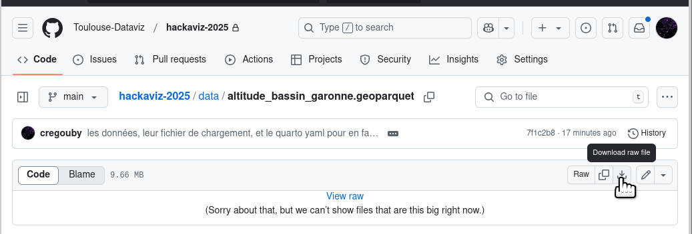
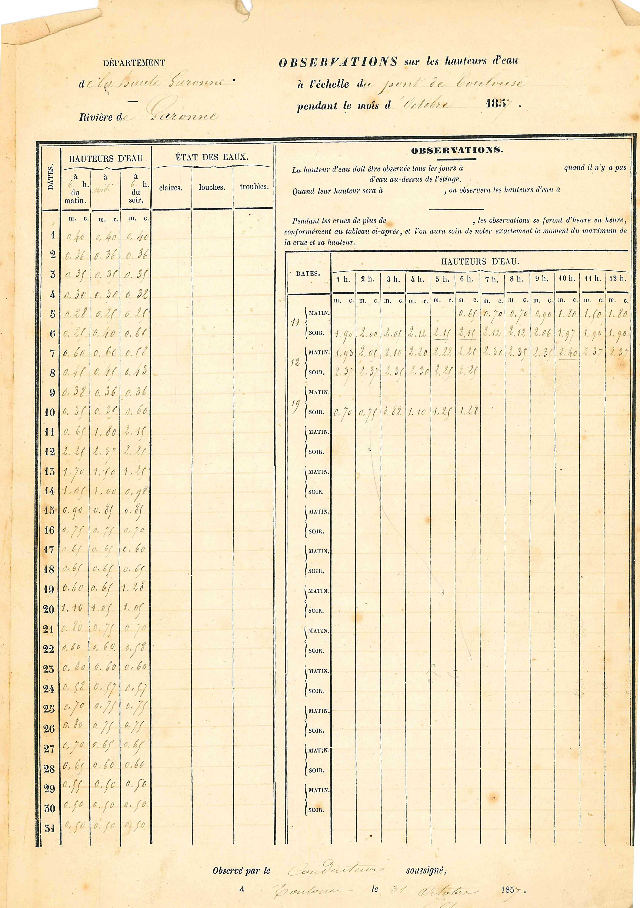
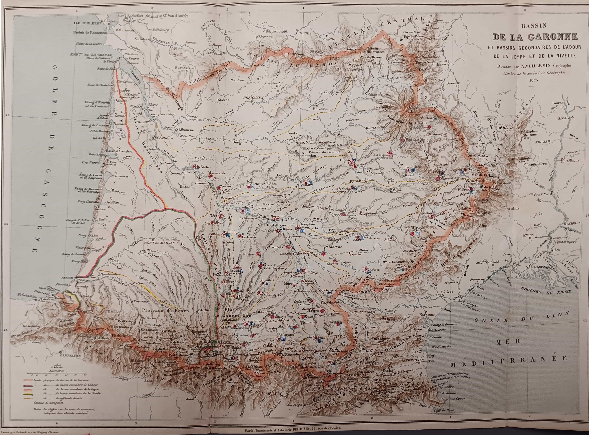

# Hackaviz-2025

<aside>

💡 AVERTISSEMENT : il y a beaucoup de jeux de données cette année, mais rien n'oblige à tout utiliser. Vous pouvez en choisir un seul jeu ou un sous-ensemble pour raconter une belle histoire.

Durant la durée de l'épreuve, un salon Discord est ouvert pour poser des questions et échanger: <https://discord.gg/wd4SKKDARC>

Pour télécharger les données vous pouvez

-   selectionner un fichier dans le dossier [`/data/`](https://github.com/Toulouse-Dataviz/hackaviz-2025/tree/main/data) et le télécharger avec le bouton Download raw file :

    

-   ou sélectionner une [release](https://github.com/Toulouse-Dataviz/hackaviz-2025/releases) sur le panneau de droite pour télécharger l'ensemble dans un `.zip`.

Pour lire les données avec les principaux logiciels, consultez la page d'[aide au chargement](https://toulouse-dataviz.github.io/hackaviz-2025/chargement_des_donnees.html).

</aside>

------------------------------------------------------------------------

# Que d’eau, que d’eau !

Toulouse Dataviz a rassemblé cette année un ensemble de jeux de données qui rend hommage aux 150 ans de la crue du 23 juin 1875 qui a dévasté de nombreuses communes dans les trois départements : Haute-Garonne, Tarn-et-Garonne et Lot-et-Garonne. 200 morts et 25 000 personnes sans logement.

A Toulouse, ont été lourdement affectés, surtout la rive gauche de la Garonne (Saint-Cyprien et Croix de Pierre) mais aussi la rive droite (Saint-Michel et les Amidonniers). Cet événement est à l’origine des constructions de prévention déployés depuis : digues, portes sur les berges, nouvelles règles de construction … Et bien sûr, la mise en place de politiques publiques de surveillance, d’alerte et de mise en sécurité si nécessaire.

[La crue de 1875 de la Garonne sur Wikipedia](https://fr.wikipedia.org/wiki/Crue_de_la_Garonne_en_1875)

[Le site de Toulouse Metropole sur les 150 ans de la crue de 1875](https://jeparticipe.metropole.toulouse.fr/processes/les150ans-crues-garonne)

Le sujet est complexe et l'événement remonte à loin, mais heureusement, les générations précédentes ont eu la sagesse de mettre en place une organisation permettant de relever systématiquement les niveaux des cours d'eau et la pluviométrie. Pendant plus d'un siècle, ce sont des milliers de petites mains qui ont, tous les jours, consigné ces données dans des cahiers qu'il pleuve, qu'il vente ou qu'il neige.



# Les données

Les données sont disponibles sous différents formats :

-   xlsx ou csv
-   json ou geojson
-   parquet ou geoparquet

Elles peuvent être directement lues sur le repository GitHub en préfixant le nom du fichier par :

```         
https://raw.githubusercontent.com/Toulouse-Dataviz/hackaviz2025/refs/heads/main/data/<nom_de_fichier.extension>
```

## 1- Les stations

Les mesures hydrométriques sont effectuées sur ces points géographiques, couvrant ce que l'on appelle le bassin versant de la Garonne : les principaux cours d'eau qui alimentent le débit de la Garonne (Ariège, Tarn, Lot, etc.). La pluviométrie est quant à elle quantifiée par des stations météorologiques qui peuvent ou non coïncider avec les stations hydrométriques.


Voici l’historique de 132 stations, leurs attributs sont :

**station**

| Attribut | Description | Exemple |
|------------------------|------------------------|------------------------|
| libelle_site | Le libellé du site de la station | Le Maudan à Fos et à Melles |
| code_station | Le code de la station | O004402001 |
| libelle_station | Le libellé de la station | La Garonne à Fos |
| libelle_cours_eau | Libellé du cours d’eau (si existant) | La Garonne |
| date_ouverture_station | Date d’ouverture de la station | 1992-01-24 |
| date_fermeture_station | Date de fermeture de la station (si existante) | année-mois-jour |
| en_service | En service à ce jour | VRAI |
| cote_zero_echelle | L'altitude du point de référence des mesures de hauteur en cm | 496,23 |
| altitude_site | L'altitude du site en m | 711 |
| libelle_commune | Libellé de la commune | BAGNERES-DE-LUCHON |
| commentaire_site | Texte libre |  |
| libelle_departement | Le nom du département | HAUTE-GARONNE |
| longitude | Longitude | 0,691927455 |
| latitude | Latitude | 42,91562157 |

## 2- Hydrométrie

### Les 9 crues de 1857 à 2022 en terme de hauteur d’eau

1857, 1875, 1879, 1900, 1905, 1952, 1977, 2000, 2022

**hauteur_eau_9_crues**

Le fichier contient un historique temporel autour des neuf crues historiques depuis 1857. Le nombre de stations actives varie d’une crue à l’autre.

| Attribut     | Description                 | Exemple             |
|--------------|-----------------------------|---------------------|
| code_station | Code de la station          | O200004001          |
| hauteur      | Hauteur d'eau en mm         | 3450                |
| date_heure   | Horodatage de l’observation | 1952-01-15 05:00:00 |
| code_crue    | Le label de la crue         | 1905                |

### Les 5 crues de 1905 à 2022 en terme de débit d’eau

1905, 1952, 1977, 2000, 2022

**debit_5_crues**

Le fichier contient un historique autour des cinq crues historiques depuis 1905. Attention le nombre de stations actives varie d’une crue à l’autre.

| Attribut | Description | Exemple |
|----|----|----|
| code_station | Code de la station | O125251001 |
| date_observation | Jour de la mesure | 1905-01-02T00:00:00.000Z |
| debit_moyen_journalier | Débit moyen journalier en m3/s | 22323 |
| code_crue | Le label de la crue | 1905 |

### Une série longue de 160 ans pour Toulouse (mesurée au Pont-Neuf)

Toutes les heures, 30 minutes, 15 minutes et 5 minutes au fur et à mesure de l’avancée technologique des moyens de mesure.

**hauteur_eau_serie_longue_toulouse** uniquement au format parquet

| Attribut     | Description                 | Exemple                  |
|--------------|-----------------------------|--------------------------|
| code_station | Code de la station          | O125251001               |
| hauteur      | Hauteur d'eau en cm         | 284                      |
| date_heure   | Horodatage de l’observation | 2022-11-14T10:15:00.000Z |

Ce fichier assez volumineux n'est disponible qu'au format parquet. 

Toutefois, un résumé quotidien plus léger est disponible :
**hauteur_eau_quotidienne_toulouse** la hauteur maximale de chacune des journées de la série longue.

## 3- Pluviométrie

Il existe des postes météo qui renseignent depuis 1809 notamment la pluviométrie. Voici un fichier qui regroupe un historique centré autour de chacune des crues.

**pluviometrie** 1857, 1875, 1879, 1900, 1905, 1952, 1977, 2000, 2022

| Attribut | Description | Exemple |
|----|----|----|
| code_pluviometre | Code de la station météorologique | 31404002 |
| nom_usuel | Nom de la station du pluviometre | SAURAT PRAT COMMUNAL |
| latitude | Latitude | 42,91562157 |
| longitude | Longitude | 0,691927455 |
| altitude | Altitude de la station du pluviomètre en m | 711 |
| date_observation | Date d’observation | 1952-01-15T00:00:00.000Z |
| precipitation | Hauteur de pluie en mm | 20,2 |
| code_crue | Le label de la crue | 1952 |

## 4- Elévations - Modèle du terrain

Pour les plus audacieux, nous avons rassemblé l’élévation d’une bande de 100m entourant le cours de chacun des cours d’eau du bassin, autrement dit l’altitude d'une grille de points au voisinage du cours d'eau.

**altitude_bassin_garonne** En 2 formats seulement : geoparquet et csv

| Attribut  | Description   | Exemple     |
|-----------|---------------|-------------|
| altitude  | Altitude en m | 711         |
| longitude | Longitude     | 0,691927455 |
| latitude  | Latitude      | 42,91562157 |

Et une version réduite à Toulouse St Cyprien **altitude_toulouse_st_cyprien** en 3 formats : geojson, geoparquet et csv.

Ce qu'il faut retenir, c'est que l'addition de la hauteur d’eau et de l'altitude du point de référence de la station fournit une grandeur **comparable** aux élévations de terrain.

# Références

Liste de principales références ayant permis de constituer les jeux de données mis à disposition.

| Référence | Source |
|------------------------------------|------------------------------------|
| [hubeau.eaufrance.fr/](https://hubeau.eaufrance.fr/) | Diffusion des données sur l'eau |
| [ign.fr](https://ign.fr) | Institut Géographique National |
| [data.gouv.fr](https://data.gouv.fr) | Plateforme des données publiques françaises |
| [vigicrues.gouv.fr](https://vigicrues.gouv.fr) | Service d'information sur le risque de crues |
